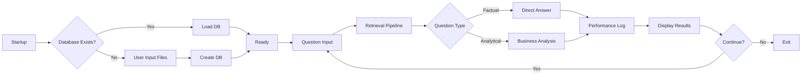
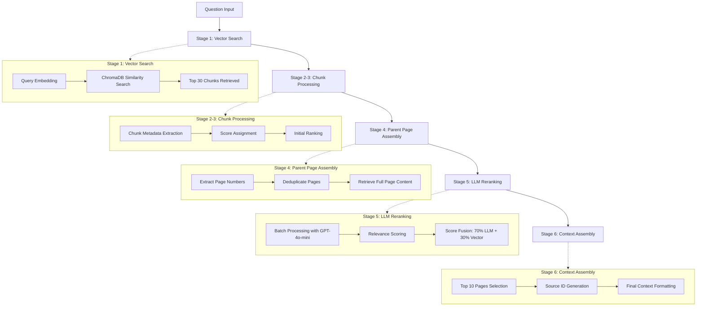

# Enhanced RAG System Documentation

## Overview

This system implements an RAG (Retrieval-Augmented Generation) system with question classification, performance monitoring, and adaptive business analysis capabilities. The system supports CPU-only operation and features persistent vector database storage for optimal user experience.

## Key Design Principles

### Multi-Language Intelligence
- Supports documents in Traditional Chinese, Simplified Chinese, English, Japanese, and other languages
- Cross-language relevance verification ensures no important information is missed
- Language-agnostic content analysis and extraction

### Intelligent Question Classification
- **Factual Queries**: Direct, concise responses for specific data requests
- **Analytical Queries**: Comprehensive business insights with strategic analysis
- Adaptive response depth based on question complexity

### Performance Monitoring
- Real-time processing time measurement (retrieval + generation)
- Precise token counting using OpenAI's official `tiktoken` library
- Throughput calculation (tokens/second)
- Comprehensive performance logging

### Smart Database Management
- Automatic detection of existing vector databases
- Skip file input when the database is available
- Persistent vector storage with `ChromaDB`
- Intelligent workflow optimization

## Document Source Management

### Document Input Method
Documents are provided through **manual file path input**:
- Users manually enter file paths when no existing vector database is found
- Interactive command-line interface prompts for file paths one by one
- Users type 'done' when finished adding files
- The system validates file existence and format compatibility before processing

### Supported File Formats
- **PDF**: Enhanced text and table extraction
- **PPTX/PPT**: Comprehensive object extraction (slides, tables, charts, images)
- **XLS/XLSX**: Structured spreadsheet parsing

### File Input Workflow
1. System checks for existing vector database
2. If no database exists, prompts user for file paths
3. Validates each file path and format
4. Processes all valid documents into vector database
5. Database persists for future sessions

## System Architecture

### Core Components

**Document Parsing System**
- **PDFParser**: Enhanced PDF extraction with `pdfplumber` + `pypdf` fallback
- **PPTXParser**: Comprehensive PPTX object extraction (tables, charts, images, groups)
- **ExcelParser**: Structured Excel parsing with `pandas`
- **UnifiedDocumentParser**: Format-specific routing and processing

**Vector Database Management**
- **VectorStoreManager**: Persistent `ChromaDB` storage and loading
- **Automatic Detection**: Smart database existence checking
- **Embedding Model**: OpenAI `text-embedding-3-small` (1536 dimensions)

**Retrieval System**
- **VectorRetriever**: Semantic similarity search with scoring
- **ParentPageAggregator**: Page-level deduplication and context assembly
- **LLMReranker**: `GPT-4o-mini` based relevance scoring
- **HybridRetriever**: Complete six-stage retrieval pipeline

**Response Generation**
- **EnhancedRAGAnswerPrompt**: Multi-language aware prompt system
- **Question Type Classification**: Automatic factual vs analytical detection
- **Business Intelligence**: Strategic analysis for complex queries
- **Structured Output**: `JSON`-formatted responses with validation

**Performance Tracking**
- **Token Counting**: Official `tiktoken`-based calculation
- **Time Measurement**: Precise stage-by-stage timing
- **Throughput Analysis**: Real-time performance metrics
- **Comprehensive Logging**: `CSV`-based performance records

## System Workflow



## Detailed Retrieval Pipeline

### Six-Stage Retrieval Process



## Question Type Classification

### Factual/Specific Queries
**Characteristics:**
- Direct data requests (revenue, dates, quantities)
- Technical specifications
- Simple fact extraction

**Response Style:**
- Concise and direct
- 3-4 analysis steps
- Focus on data extraction
- Minimal business interpretation

**Example:**
```
Q: "What is TSMC's Q3 2024 revenue?"
A: "According to TSMC's Q3 2024 financial report, the quarterly revenue was 759.69 billion TWD."
```

### Analytical/Strategic Queries
**Characteristics:**
- Trend analysis requests
- Competitive positioning questions
- Strategic implications

**Response Style:**
- Comprehensive business analysis
- 5+ analysis steps 
- Strategic thinking and market dynamics
- Business insights and implications

**Example:**
```
Q: "Analyze TSMC's main revenue growth drivers for 2025"
A: "From a strategic perspective, TSMC is positioned at the core of the AI revolution..."
[Full business analysis with strategic insights]
```

## Installation

### Environment Creation

Create a new conda environment with Python 3.10:

```bash
conda create -n rag python=3.10
conda activate rag
```

### Dependencies

Install required packages using the provided requirements file:

```bash
pip install -r requirements.txt
```

### Environment Setup

Create a `.env` file with your OpenAI API key:

```bash
echo "OPENAI_API_KEY=your_api_key_here" > .env
```

### Optional: Enable Telemetry

```bash
echo "ENABLE_TELEMETRY=true" >> .env
```

## Usage

### Basic Operation

```bash
python rag.py
```

### System Behavior

**First Run (No Database):**
1. System checks for an existing database
2. Prompts user to input file paths manually
3. Processes documents and creates a database
4. Ready for questions

**Subsequent Runs (Database Exists):**
1. The system detects the existing database
2. Automatically loads the database
3. Immediately ready for questions
4. No file input required

### File Input Process

When no database exists, the system will prompt:
```
Please enter file paths for processing.
Supported formats: PDF, PPTX, XLS/XLSX
Enter file paths one by one. Type 'done' when finished.....

File 1 (or 'done'): /path/to/your/document.pdf
Added: /path/to/your/document.pdf
File 2 (or 'done'): /path/to/your/presentation.pptx
Added: /path/to/your/presentation.pptx
File 3 (or 'done'): done
```

### Supported File Formats

- **PDF**: Text and table extraction with OCR fallback
- **PPTX**: Complete object extraction (text, tables, charts, images)
- **Excel (.xls/.xlsx)**: Structured data parsing with `pandas`

### Query Examples

```bash
# Factual Query
Question: What is TSMC's 2024 revenue?

# Analytical Query  
Question: Analyze TSMC's competitive advantages and risks in AI market

# Multi-language Query
Question: Compare TSMC's advanced process revenue with competitors
```

## Performance Features

### Real-Time Monitoring

**Timing Measurements:**
- Retrieval time (seconds)
- Generation time (seconds)
- Total processing time (seconds)

**Token Analysis:**
- Input token count (precise `tiktoken` calculation)
- Output token count
- Total tokens processed
- Throughput (tokens/second)

### Performance Output Example

```
Retrieval completed with 10 results in 1.234s
Generation completed in 2.567s
Tokens: 1,200 input + 350 output = 1,550 total
Throughput: 410.5 tokens/second

==================================================
PERFORMANCE SUMMARY
==================================================
Retrieval Time: 1.234s
Generation Time: 2.567s
Total Processing Time: 3.801s
Input Tokens: 1,200
Output Tokens: 350
Total Tokens: 1,550
Throughput: 410.5 tokens/second
```

### Performance Logging

All queries are logged to `enhanced_rag_qa_log.csv` with:
- Question and answer content
- Confidence levels and source attribution
- Detailed performance metrics
- Database usage status

## Output Format

### Structured JSON Response

```json
{
  "step_by_step_analysis": "Detailed analysis (100-150+ words based on question type)",
  "reasoning_summary": "Concise synthesis summary (50-80 words)",
  "relevant_sources": ["source_file_page_1", "source_file_page_2"],
  "confidence_level": "high|medium|low",
  "final_answer": "Traditional Chinese response with business insights"
}
```

### Number Formatting

The system automatically formats large numbers with Chinese descriptions:

```
2,894,307,699(28 billion 943 million 76 thousand 99)
289.43 billion → 2,894,300,000,000(2.89 trillion)
```

## Advanced Features

### Multi-Language Processing
- Automatic language detection and processing
- Cross-language relevance verification
- Unified response in Traditional Chinese

### Smart Chunking Strategies
- **Excel**: Preserve table structure and relationships
- **PPTX**: Maintain object relationships and slide context
- **PDF**: Enhanced text extraction with number formatting

### Business Intelligence
- Strategic analysis for complex queries
- Competitive dynamics assessment
- Risk and opportunity identification
- Stakeholder impact analysis

## Configuration Options

### Retrieval Parameters
```python
# Adjustable in HybridRetriever.retrieve()
llm_reranking_sample_size = 30  # Initial chunk count
documents_batch_size = 2        # LLM batch size
top_n = 10                      # Final pages returned
llm_weight = 0.7               # LLM score weight
```

### Document Processing
```python
# Adjustable in TextSplitter
chunk_size = 300               # Tokens per chunk
chunk_overlap = 50             # Overlap between chunks
```

### Performance Tuning
```python
# Vector database location
persist_directory = "chromadb_new"

# Embedding model
embedding_model = "text-embedding-3-small"

# LLM models
reranking_model = "gpt-4o-mini"
generation_model = "gpt-4o-mini"
```

## Error Handling

### Robust Processing
- Graceful document parsing failures
- Multiple `PDF` extraction strategies
- Safe `PPTX` object processing
- Comprehensive exception handling

### Performance Safeguards
- Token calculation fallback mechanisms
- Time measurement error recovery
- Database connection validation
- Memory usage optimization

## Best Practices

### Document Quality
- Ensure clear document structure
- Use consistent formatting
- Include relevant metadata
- Optimize for multi-language content

### Query Optimization
- Use specific terminology for factual queries
- Frame strategic questions clearly
- Leverage domain knowledge
- Consider document language diversity

### System Maintenance
- Monitor performance logs regularly
- Clear the database when documents change significantly
- Update dependencies periodically
- Backup important query logs

## Extension Points

### Custom Processing
- Additional document format support
- Custom embedding models
- Alternative `LLM` providers
- Enhanced business analysis frameworks

### Integration Options
- External database connections
- `API` endpoint creation
- Batch processing capabilities
- Real-time document monitoring

This enhanced `RAG` system provides a comprehensive solution for multi-language document analysis with intelligent question handling and detailed performance monitoring. 
