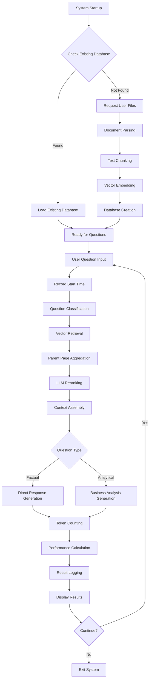
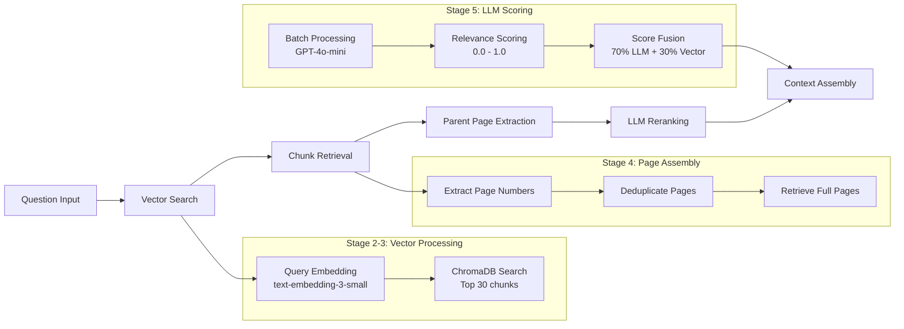

# Overview

This system implements an RAG (Retrieval-Augmented Generation) system with  question classification, performance monitoring, and adaptive business analysis capabilities. The system supports CPU-only operation and features persistent vector database storage for optimal user experience.

## Key Design Principles

### Multi-Language Intelligence
- Supports documents in Traditional Chinese, Simplified Chinese, English, Japanese, and other languages
- Cross-language relevance verification ensures no important information is missed
- Language-agnostic content analysis and extraction

### Intelligent Question Classification
- **Factual Queries**: Direct, concise responses for specific data requests
- **Analytical Queries**: Comprehensive business insights with strategic analysis
- Adaptive response depth based on question complexity

### Performance Monitoring
- Real-time processing time measurement (retrieval + generation)
- Precise token counting using OpenAI's official `tiktoken` library
- Throughput calculation (tokens/second)
- Comprehensive performance logging

### Smart Database Management
- Automatic detection of existing vector databases
- Skip file input when database available
- Persistent vector storage with `ChromaDB`
- Intelligent workflow optimization

## System Architecture

### Core Components

**Document Parsing System**
- **PDFParser**: Enhanced PDF extraction with `pdfplumber` + `pypdf` fallback
- **PPTXParser**: Comprehensive PPTX object extraction (tables, charts, images, groups)
- **ExcelParser**: Structured Excel parsing with `pandas`
- **UnifiedDocumentParser**: Format-specific routing and processing

**Vector Database Management**
- **VectorStoreManager**: Persistent `ChromaDB` storage and loading
- **Automatic Detection**: Smart database existence checking
- **Embedding Model**: OpenAI `text-embedding-3-small` (1536 dimensions)

**Retrieval System**
- **VectorRetriever**: Semantic similarity search with scoring
- **ParentPageAggregator**: Page-level deduplication and context assembly
- **LLMReranker**: `GPT-4o-mini` based relevance scoring
- **HybridRetriever**: Complete six-stage retrieval pipeline

**Response Generation**
- **EnhancedRAGAnswerPrompt**: Multi-language aware prompt system
- **Question Type Classification**: Automatic factual vs analytical detection
- **Business Intelligence**: Strategic analysis for complex queries
- **Structured Output**: `JSON` formatted responses with validation

**Performance Tracking**
- **Token Counting**: Official `tiktoken`-based calculation
- **Time Measurement**: Precise stage-by-stage timing
- **Throughput Analysis**: Real-time performance metrics
- **Comprehensive Logging**: `CSV`-based performance records

## System Workflow



## Detailed Retrieval Pipeline

### Six-Stage Retrieval Process



## Question Type Classification

### Factual/Specific Queries
**Characteristics:**
- Direct data requests (revenue, dates, quantities)
- Technical specifications
- Simple fact extraction

**Response Style:**
- Concise and direct
- 3-4 analysis steps (~100 words)
- Focus on data extraction
- Minimal business interpretation

**Example:**
```
Q: "台積電2024年Q3營收是多少？"
A: "根據台積電2024年第三季財務報告，該季營收為759.69 billion新台幣(7千5百96億9千萬新台幣)。"
```

### Analytical/Strategic Queries
**Characteristics:**
- Trend analysis requests
- Competitive positioning questions
- Strategic implications

**Response Style:**
- Comprehensive business analysis
- 5+ analysis steps (150+ words)
- Strategic thinking and market dynamics
- Business insights and implications

**Example:**
```
Q: "說明台積電2025年主要營收成長動力"
A: "從戰略角度分析，台積電正處於AI革命浪潮的核心位置..."
[Full business analysis with strategic insights]
```

## Installation

### Environment Creation

Create a new conda environment with Python 3.10:

```bash
conda create -n rag python=3.10
conda activate rag
```

### Dependencies

Install required packages using the provided requirements file:

```bash
pip install -r requirements.txt
```

### Environment Setup

Create a `.env` file with your OpenAI API key:

```bash
echo "OPENAI_API_KEY=your_api_key_here" > .env
```

### Optional: Enable Telemetry

```bash
echo "ENABLE_TELEMETRY=true" >> .env
```

## Usage

### Basic Operation

```bash
python rag.py
```

### System Behavior

**First Run (No Database):**
1. System checks for existing database
2. Requests file input from user
3. Processes documents and creates database
4. Ready for questions

**Subsequent Runs (Database Exists):**
1. System detects existing database
2. Automatically loads database
3. Immediately ready for questions
4. No file input required

### Supported File Formats

- **PDF**: Text and table extraction with OCR fallback
- **PPTX**: Complete object extraction (text, tables, charts, images)
- **Excel (.xls/.xlsx)**: Structured data parsing with `pandas`

### Query Examples

```bash
# Factual Query
Question: 台積電2024年營收是多少？

# Analytical Query  
Question: 分析台積電在AI市場的競爭優勢和風險

# Multi-language Query
Question: Compare TSMC's advanced process revenue with competitors
```

## Performance Features

### Real-Time Monitoring

**Timing Measurements:**
- Retrieval time (seconds)
- Generation time (seconds)
- Total processing time (seconds)

**Token Analysis:**
- Input token count (precise `tiktoken` calculation)
- Output token count
- Total tokens processed
- Throughput (tokens/second)

### Performance Output Example

```
Retrieval completed with 10 results in 1.234s
Generation completed in 2.567s
Tokens: 1,200 input + 350 output = 1,550 total
Throughput: 410.5 tokens/second

==================================================
PERFORMANCE SUMMARY
==================================================
Retrieval Time: 1.234s
Generation Time: 2.567s
Total Processing Time: 3.801s
Input Tokens: 1,200
Output Tokens: 350
Total Tokens: 1,550
Throughput: 410.5 tokens/second
```

### Performance Logging

All queries are logged to `enhanced_rag_qa_log.csv` with:
- Question and answer content
- Confidence levels and source attribution
- Detailed performance metrics
- Database usage status

## Output Format

### Structured JSON Response

```json
{
  "step_by_step_analysis": "Detailed analysis (100-150+ words based on question type)",
  "reasoning_summary": "Concise synthesis summary (50-80 words)",
  "relevant_sources": ["source_file_page_1", "source_file_page_2"],
  "confidence_level": "high|medium|low",
  "final_answer": "Traditional Chinese response with business insights"
}
```

### Number Formatting

The system automatically formats large numbers with Chinese descriptions:

```
2,894,307,699(28億9千4百30萬7千6百99)
289.43 billion → 2,894,300,000,000(2兆8千9百43億)
```

## Advanced Features

### Multi-Language Processing
- Automatic language detection and processing
- Cross-language relevance verification
- Unified response in Traditional Chinese

### Smart Chunking Strategies
- **Excel**: Preserve table structure and relationships
- **PPTX**: Maintain object relationships and slide context
- **PDF**: Enhanced text extraction with number formatting

### Business Intelligence
- Strategic analysis for complex queries
- Competitive dynamics assessment
- Risk and opportunity identification
- Stakeholder impact analysis

## Configuration Options

### Retrieval Parameters
```python
# Adjustable in HybridRetriever.retrieve()
llm_reranking_sample_size = 30  # Initial chunk count
documents_batch_size = 2        # LLM batch size
top_n = 10                      # Final pages returned
llm_weight = 0.7               # LLM score weight
```

### Document Processing
```python
# Adjustable in TextSplitter
chunk_size = 300               # Tokens per chunk
chunk_overlap = 50             # Overlap between chunks
```

### Performance Tuning
```python
# Vector database location
persist_directory = "chromadb_new"

# Embedding model
embedding_model = "text-embedding-3-small"

# LLM models
reranking_model = "gpt-4o-mini"
generation_model = "gpt-4o-mini"
```

## Error Handling

### Robust Processing
- Graceful document parsing failures
- Multiple `PDF` extraction strategies
- Safe `PPTX` object processing
- Comprehensive exception handling

### Performance Safeguards
- Token calculation fallback mechanisms
- Time measurement error recovery
- Database connection validation
- Memory usage optimization

## Best Practices

### Document Quality
- Ensure clear document structure
- Use consistent formatting
- Include relevant metadata
- Optimize for multi-language content

### Query Optimization
- Use specific terminology for factual queries
- Frame strategic questions clearly
- Leverage domain knowledge
- Consider document language diversity

### System Maintenance
- Monitor performance logs regularly
- Clear database when documents change significantly
- Update dependencies periodically
- Backup important query logs

## Extension Points

### Custom Processing
- Additional document format support
- Custom embedding models
- Alternative `LLM` providers
- Enhanced business analysis frameworks

### Integration Options
- External database connections
- `API` endpoint creation
- Batch processing capabilities
- Real-time document monitoring

This enhanced `RAG` system provides a comprehensive solution for multi-language document analysis with intelligent question handling and detailed performance monitoring. 
